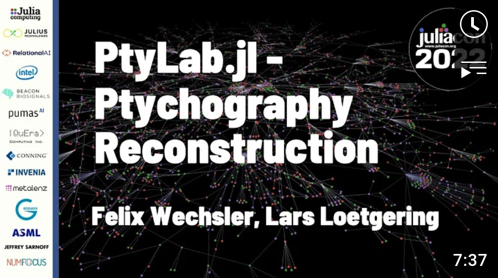

# PtyLab.jl

Conventional Ptychography is a lensless microscopy imaging technique which captures a sequence of light diffraction patterns to solve the optical phase problem. The resulting datasets are large and can typically not directly be solved. Instead, iterative reconstruction algorithms with low runtime memory footprint are employed. Here we present PtyLab.jl, a software for ptychographic data analysis and demonstrate how a functional programming style in Julia allows for performant iterative algorithms.


See this [Optics Express article](https://opg.optica.org/oe/fulltext.cfm?uri=oe-31-9-13763&id=529026).


| **Build Status**                          | **Code Coverage**               |
|:-----------------------------------------:|:-------------------------------:|
| [![][CI-img]][CI-url] | [![][codecov-img]][codecov-url] |

# License
Please read the [license](https://github.com/PtyLab/PtyLab.jl/blob/main/LICENSE.md) before usage! 
One important part is the use of this software "for academic, non-commercial purposes" only.


## Installation
Via the [Julia-REPL](https://julialang.org/) add [PtyLab.jl](https://github.com/PtyLab/PtyLab.jl) with the following command:
```julia
julia> ] add https://github.com/PtyLab/PtyLab.jl/
```

To start the Jupyter notebooks, clone or download a [.zip](https://github.com/PtyLab/PtyLab.jl/archive/refs/heads/main.zip) of this repository. 
Extract it.
Then open a Julia REPL and type the following to install the Jupyter kernel:
```julia
julia> ] add IJulia

julia> using IJulia

julia> notebook()
```
A browser should open. Navigate to the location of the notebooks and open them.

## Feature Set
Right now, only CP reconstruction works. For more functionality, please see the [PtyLab.m](https://github.com/PtyLab/PtyLab.m) and the [PtyLab.py](https://github.com/PtyLab/PtyLab.py).

The following features are implemented:
* simple Ptychography reconstruction (loading from a .hdf5 file)
* ePIE
* CUDA support
* probe center of mass restriction
* regular randomized grid generation (for usage of translation stages)

The structure should be flexible to add more solvers, etc.


## Tutorials
* [Real data reconstruction](examples/Introduction_real_data_reconstruction.ipynb)
* [Simple simulation and reconstruction](examples/simple_simulation_and_reconstruction.ipynb)
* [Another artificial simulation and reconstruction](examples/cuda_simulation_and_reconstruction.ipynb)

## Questions?
Feel free to open an issue if anything does not work or is unclear!
You can also join [my conference room](https://epfl.zoom.us/my/wechsler). Give me a minute to join!

## JuliaCon 2022
* [Pluto notebook](examples/JuliaCon_2022.jl) for this video

<a  href="https://www.youtube.com/watch?v=pDp83OxBJ_I"></a>

## More Information and Citation
See this [Optics express article](https://opg.optica.org/oe/fulltext.cfm?uri=oe-31-9-13763&id=529026).
```
@article{Loetgering:23,
author = {Lars Loetgering and Mengqi Du and Dirk Boonzajer Flaes and Tomas Aidukas and Felix Wechsler and Daniel S. Penagos Molina and Max Rose and Antonios Pelekanidis and Wilhelm Eschen and J\"{u}rgen Hess and Thomas Wilhein and Rainer Heintzmann and Jan Rothhardt and Stefan Witte},
journal = {Opt. Express},
keywords = {Aperture synthesis; Imaging techniques; Optical coherence tomography; Phase imaging; Phase retrieval; Scanning electron microscopy},
number = {9},
pages = {13763--13797},
publisher = {Optica Publishing Group},
title = {PtyLab.m/py/jl: a cross-platform, open-source inverse modeling toolbox for conventional and Fourier ptychography},
volume = {31},
month = {Apr},
year = {2023},
url = {https://opg.optica.org/oe/abstract.cfm?URI=oe-31-9-13763},
doi = {10.1364/OE.485370},
abstract = {Conventional (CP) and Fourier (FP) ptychography have emerged as versatile quantitative phase imaging techniques. While the main application cases for each technique are different, namely lens-less short wavelength imaging for CP and lens-based visible light imaging for FP, both methods share a common algorithmic ground. CP and FP have in part independently evolved to include experimentally robust forward models and inversion techniques. This separation has resulted in a plethora of algorithmic extensions, some of which have not crossed the boundary from one modality to the other. Here, we present an open source, cross-platform software, called PtyLab, enabling both CP and FP data analysis in a unified framework. With this framework, we aim to facilitate and accelerate cross-pollination between the two techniques. Moreover, the availability in Matlab, Python, and Julia will set a low barrier to enter each field.},
}
```

[docs-dev-img]: https://img.shields.io/badge/docs-dev-pink.svg
[docs-dev-url]: https://ptylab.github.io/PtyLab.jl/dev/

[docs-stable-img]: https://img.shields.io/badge/docs-stable-darkgreen.svg
[docs-stable-url]:  https://ptylab.github.io/PtyLab.jl/stable/

[CI-img]: https://github.com/ptylab/PtyLab.jl/actions/workflows/ci.yml/badge.svg
[CI-url]: https://github.com/ptylab/PtyLab.jl/actions/workflows/ci.yml

[codecov-img]: https://codecov.io/gh/PtyLab/PtyLab.jl/branch/main/graph/badge.svg?token=OQ6BQCUFQB
[codecov-url]: https://codecov.io/gh/ptylab/PtyLab.jl
